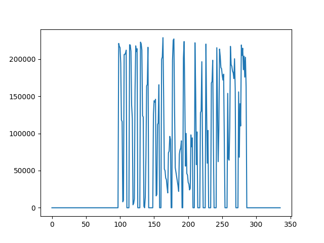

# copy from Zhao EnMin

 
 \# python -m baselines.MuscleMemory.MontezumasR.State_Im_Montezu
 
 mas.py
 
 # To Do
 
+ can we use the deep q + mm to play with MontezumaRevenge
     + run Montezuma first:
     + encode the obs into state (discrete)
        + use the grid to encode each state every 10 pixel,so we have 21*16 states
     + random action and to ensure whether it can be discovered 
        + Importance of state in Montezuma R, random action 1000 trj, top 20 was shown below. data are stored in "im1.txt"
        
        
        + plot show
        
        
        
     + if we have , we can solve the env with methods before
     to do!!!!

