# copy from Zhao EnMin

 \# python -m baselines.MuscleMemory.tianmap
 
 \# python -m baselines.MuscleMemory.run
 

 
 
 
 # To Do
 
 *Note!!!! when we change the map , we should change the function obs_to_state at the same time
 
+ calculate the importance of the state , 
    + make the env work
    + take the random policy or Q-based  policy
    + get enough state stochastic analysis 
        + how about the length of trjs
    + visualize them in the env
    + to test whether it is an important one
        + state importance by q learning
        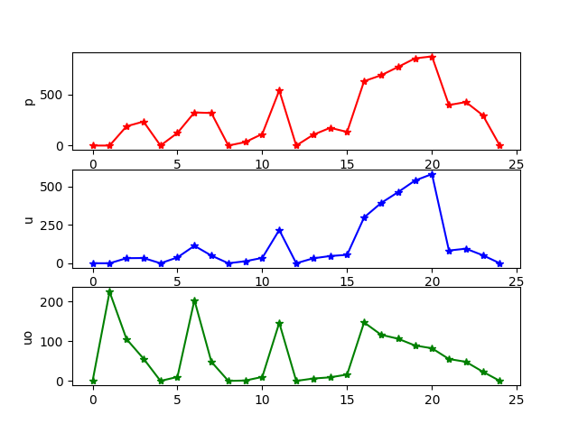
        + state importance by random
        
        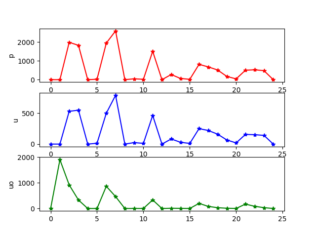
    + \# python -m baselines.MuscleMemory.run
    + and then , learn a policy to achieve goal in less steps
        + we need some episodes to do the random exploration
        + add the stochastic character into Q-learning
        + \# python -m baselines.MuscleMemory.DeepQ_MM
        + here we use q learning with the importance of state
        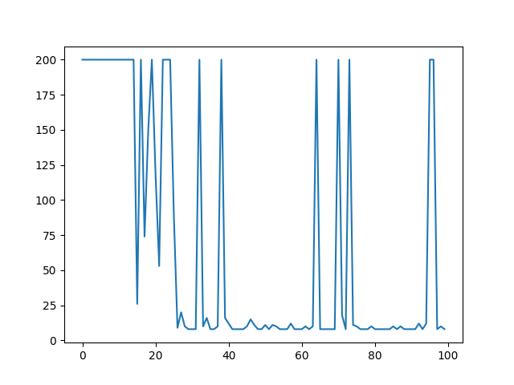
        + compare with the q learning ( notice : not deep q , just q learning)
        +\# python -m baselines.MuscleMemory.DeepQ_only
        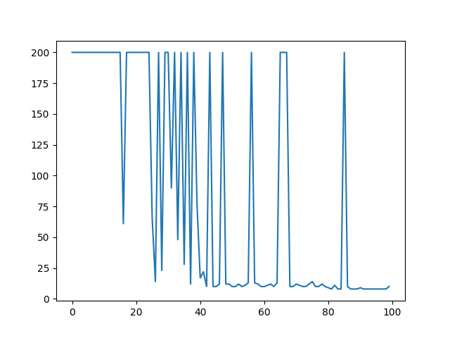
        + now we need more times of simulations to validate our results
        + here, we just evaluate the average steps to demonstrate that our method , named Qmm, can achieve the goal steadily in less steps
        the blue one means the average step of q, the read one q_mm
        + but we did not see any improve  by this result,why?
        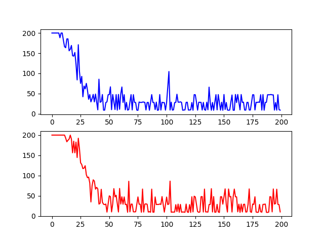
        + this code is not friendly to paras-choice ******
        + here is the results with paras: 0.5-0.3-0.1 fac = 0.01
        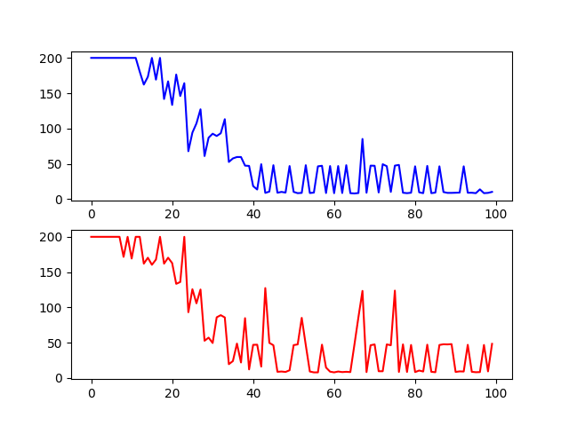
        + once we get the reward from env, we should weaken the influence of Im(s)
        fac = steps * fac / 200
        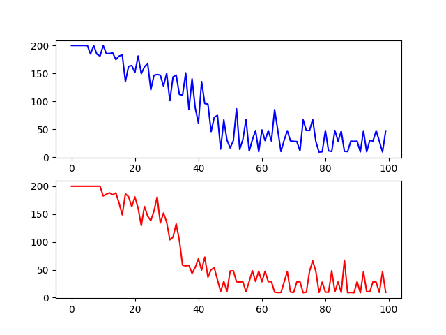
        + 40times ,no improvement at all
        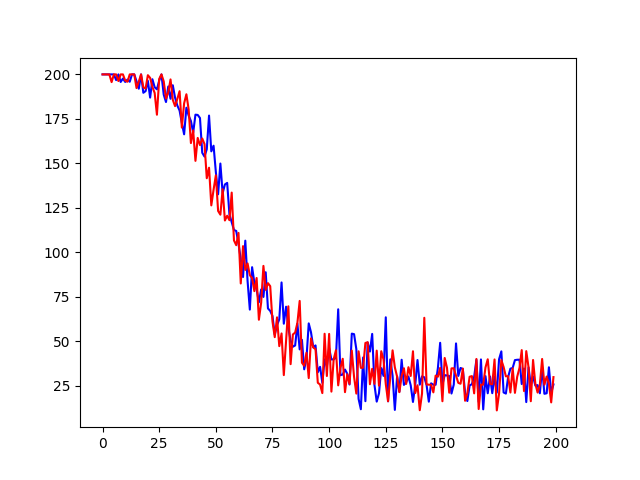
    + add some random exploration before we learn 
        + improve a bit 
        paras: 0.5;0.4;0.3; fac = 0.1 and data in 0625-3.txt
        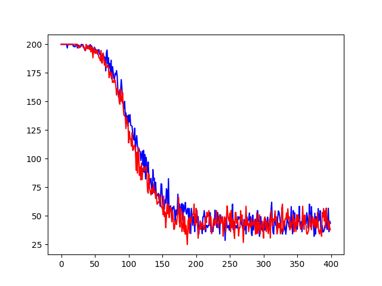
        
        paras: 0.55;0.5;0.45; fac =0.1 with no decay and data in 0625-4.txt
        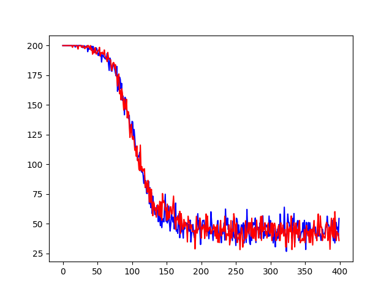
        
        paras: 0.55;0.5;0.45; fac =0.1 with decay and data in 0625-4.txt
        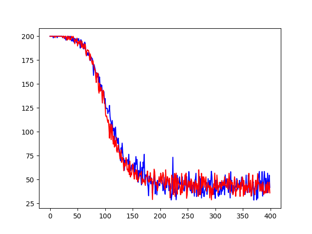
        
        with the state importance as 
        
        
        here is the env
        
        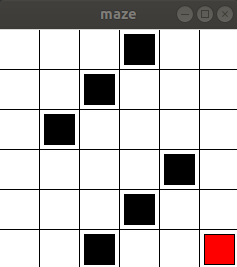
+ make a comparision with reward-based-only method
    + add it to the Deep Q

+ can we use the deep q + mm to play with MontezumaRevenge
     + run Montezuma first:
     + encode the obs into state (discrete)
        + use the grid to encode each state every 10 pixel,so we have 21*16 states
     + random action and to ensure whether it can be discovered 
        + Importance of state in Montezuma R, random action 1000 trj, top 20 was shown below. data store in "im.txt"
        
        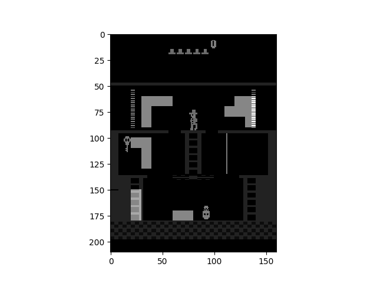
        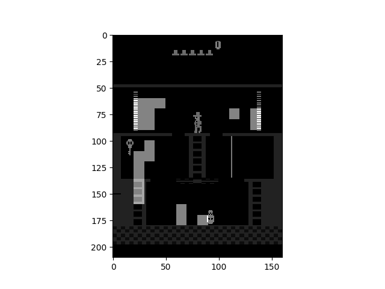
        + plot show
        
        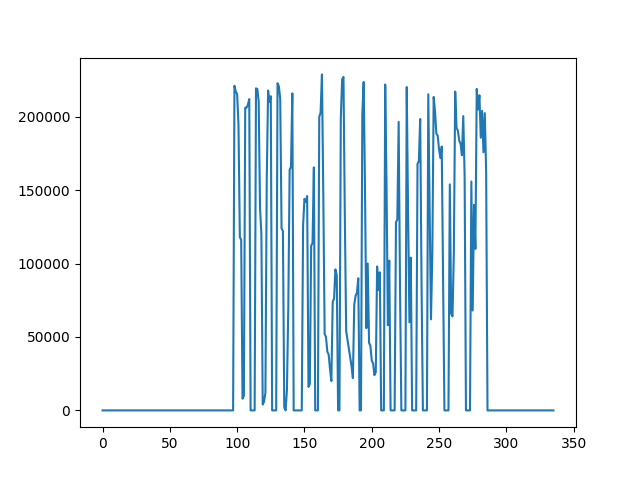
     + we change the Importance calculation 
        + Im_s[i] = Im_s[i] + w# 出现的顺序 越晚月重要？轨迹中
        + Im_p[i]=Im_p[i]+r[eps][w]#状态出现的次数
        + Im_s[i] = Im_s[i]/Im_p[i]
        + the state 
        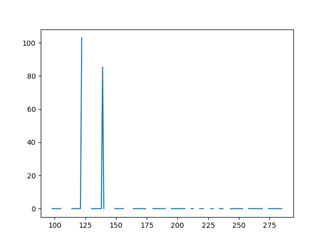
        + show in the env
        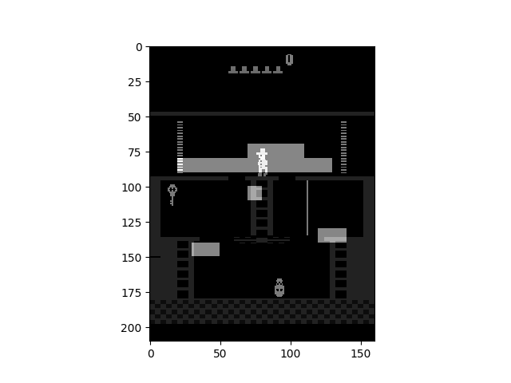  
        
        + Im_s[i] = Im_p[i]/Im_s[i]
        + the state
        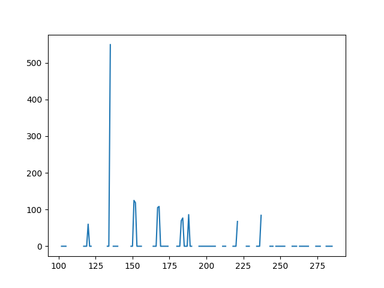 
        + show in the env
        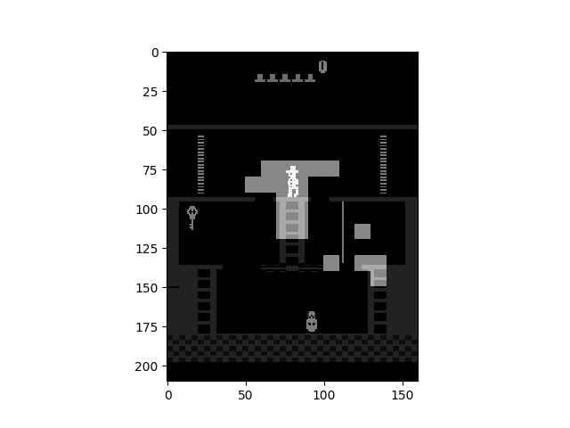
     + if we have , we can solve the env with methods before
     to do!!!!
# Notes

+ the closer to the end, the more important it is .
+ what we want to find is the  extreme point. 
    + so we have to give some local searching to the process 
    +  this visualize system should be shown in 2D 
    + the connected of value of s might be a best policy
+ 情节记忆也称为情景记忆（episodic memory）是属于长时记忆的一种。
指的是与一定的时间、地点及具体情境相联系的事件的识记、保持和再现。
这种记忆与个人的亲身经历分不开，最大特点是具有情节性，如想起自己参加过的一个会议或曾去过的地方。
情节记忆经常处于不断变化的状态，保持的信息也常变化，因此不易提取.    
+ uptrend state navigation
+ analysis the results: once we get a reward, the q learning will be convergence quickly 
but the q mm will not, so, when we got the reward we should turn to Q learning
+ what we want to found maybe the local maximum point,which may be more corresponded to the structure of env

+ 统计图像方差

 \# python -m baselines.MuscleMemory.cov_Im_Montezumas
 
    +随机探索
    +计算均值 及 方差

