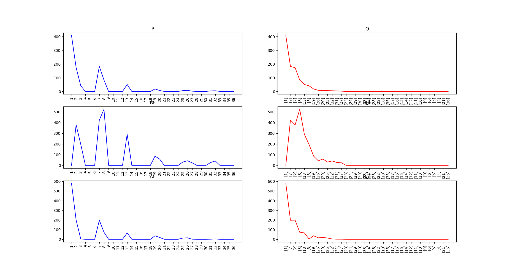

# Run by these command:

\# python -m baselines.UpTrend.test

# To Do

## Maze 环境

+ 获取关键状态，并进行可视化
+ 按步运行，并动态显示我们找到的关键状态 
+ 为关键状态赋值，并将其融入Qlearning 算法
+ 设计并完成比较实验，证明， 这种发现关键状态的方法可以加速Q-Learning的收敛 

## Montezuma's R

# Note & Results

## Maze 环境

环境截图：

\# python -m baselines.UpTrend.State_Im_MAZE

通过统计的方法寻找可能用来衡量状态重要性的指标
+ 随机与环境交互 M 次，每次走 N 步， 得到轨迹 集合 trjs
+ 通过对trjs进行统计，得到以下可能的评价指标
+ SumWi= SumWik(trjs) #状态 S_k 在所有轨迹中出现的顺序总和
+ P_k #状态S_k出现的数目总和
+ BE_k #状态 S_k之前出现的状态的统计数量总和
+ AF_k #状态 S_k之后出现的状态的统计数量总和
+ O #P_k 从高到底排序之后的结果
+ OBE_k # 排序之后对应的BE_k, 涵义难易程度相近的几个状态，谁之前包含的信息更多
+ OAF_k # 排序之后对应的AF_k
+ 未完待续。。。

step = 10 n_trjs = 100 三次随机实验结果

step = 20 n_trjs =100 三次随机实验结果

step = 30 n_trjs = 100 三次随机实验的结果

从效果上看，OBE中所见更符合我们对重要状态的直观认知，且，step选择多了会让后面的状态有更多机会进入视野当中 来

另外，观察了一下OBE/O的效果：

step = 10 n_trjs= 100 (OBE/O的效果在第六个子图中)

step = 20 n_trjs= 100 (OBE/O的效果在第六个子图中)

step = 30 n_trjs= 100 (OBE/O的效果在第六个子图中)

但是实验效果并不稳定，随机性比较大

尝试求出对应的极点，按照难易程度引入值函数。（这里的难易程度指得是出现次数的多少）

\# python -m baselines.UpTrend.UptrendStateValueRL

暂时先用 OBE 试验整个流程，然后引入不同的定义方式，未完成

\#  python -m baselines.UpTrend.UptrendStateValueRL_v1

zem 的推进下，能得到基本的实验流程，仍然存在细节问题，比如，出现环状节点时会陷入局部最优
初步的解决方案是，通过OBE的引入对比当前节点更容易的状态进行排除。

但是现在引入obe之后要改动的变量较多，尝试保存该版本，方便进行下次迭代。

这个版本可用环境是 maze_env20, 而且是越多的黑洞跑得越轻松。

\#  python -m baselines.UpTrend.UptrendStateValueRL_v2

环境用maze_env10

这一版的目标是能够尝试各种定义方式，并能够给出评价指标。

尝试在RL_brain 中写入基础的PG算法,以及 deep 版本的Qlearning

+ 针对 Q Learning 我们需要对 Im 设置差异性更大的

+ 而且要按照轨迹进行更新,要判断一个轨迹能够完成之后再进行更新

+ 学不出来的原因Im(s)中评价的最好的点,距离我们上一次的目标点太远了,也就是 N设置太大了,我们的qlearning 无法学习到该点

+ 对之前的认知没有修正机制,也就是我们并不知道自己是对是错,也没有好的机制可以解释这个问题

+ 面临着Q表收敛太慢的问题,为什么新设定的目标点更容易到达，却不容易收敛呢？

+ 如果我们找不到新的最大值了怎么办？代码中原先就把 number 置为0了， 这样就是最后一个点成为了焦点，但是有的时候在段时间内是无法到达该点的。

+ 感觉这个generate 和 train 可以尝试放到一起去

+ 从效果看 maze 为20 10万步之内 qlearning 是没有效果的，但是 state-value 至少可以向前推进

+ 但是会在某些中间状态出现不稳定情况

接下来做两件事情：
+ 1. 完成多个评估方法的比较
+ 2. 与不同的学习策略结合

然后要完成的就是把每条轨迹留存下来，而不是每次都进行那么多的随机探索。减少迭代的次数，也就是在减少建模的成本。

\#  python -m baselines.UpTrend.UptrendStateValueRL_v3

环境 env 10 ， agent RL_brain

从新改编状态编码，为后来过渡做准备。 20190730

先保留编码，然后把编码部分彻底变成无语义信息的内容。

环境不能频繁给奖励，哪怕是负数也不可以。

先做策略迭代的形式，也就是所要收敛之后再去更新策略。

beforestate 没有加

random.seed(i*i+0.4567)

实验中出现的问题： 

+ 很容易进入比如编号为16的点，然后就卡死在里面出不来
+ 会进入81 82等区域，因为探索过的就不会再从新赋值，所以，我们缺乏这种自我修复的机制
+ 可以尝试让产生轨迹的策略具有更大的随机性

v3版本是状态重新编码之后能用的版本，保存。上面看到的

\#  python -m baselines.UpTrend.UptrendStateValueRL_v4

v4版本配套的agent 是RLbrain 4, 环境仍然是maze env 10 。

1.如果在探索过程中得到奖励，那么就要对所有走过的Im 重新编码

    + 可以每走一条轨迹进行一次编码，一次训练
    + 最终的steps需要处理
    + 我们相当与在没有获得奖励之前给出一个通用的指导方向，这个探索方向更有可能探索更广阔的空间。

2.AF+BE * minStep

3.评价结果的方法

    + 每次到达终点所用的步数，以回合计算。这样怎么跟q对比呢？
       加入探索的总步数
       env 10, RL brain 4 , tempn30, 橙色是每个回合的步数，兰色为总步数,可以看到在这个环境里大约需要八万步左右的探索能够得到较为稳定的策略。

    + 对比Q表学习的结果：
    
  
  
    + env 20 rlbrain 4 tempn 30 

    + uptrendVS     大约在八万步左右稳定到探索步骤
    

    + Q   大约10万步左右
    

    + 也有收敛比较快的

    + 发挥并不稳定

但是我们不能说明是模仿学习的效果还是我么做探索状态指导部分的效果。
目前还只是单次实验，不能证明就一定会好。

重新整理实验，尝试证明这一点。

这里需要调节不同的探索步骤

为啥每次只多走一步呢？

\#  python -m baselines.UpTrend.UptrendStateValueRL_v5

RL_brain5, maze_env5 （未完成）

+ 整体流程尝试更改，先用generate 产生一部分轨迹，
然后根据当前策略的提升情况，用训练数据，作为P的增量式计算。顺便把各种定义的增量表达写出来。
+ 规范化探索步骤的表达，现在写得比较乱，毫无章法。毫无依据。

+ 有死亡点，但是没有奖励的做法并不可行，都没有实验结果。

## PG + Im(s)

基本思路：
+ 先试一下PG能不能运行
+ 如果能，改到Maze环境中
+ 作为baseline,挑出来效果图
+ 重新改写评价函数，调节参数，先保证能运行，再尝试更好的效果

\# python -m baselines.UpTrend.run_MountainCar

源代码可以运行，就是美等到收敛

\#  python -m baselines.UpTrend.UptrendStateValueRL_v6

尝试改变运行环境,仍然使用原先的 agent 
RLbrain6 , maze_env6

为啥得到一次就不再跑了？
好像奖励的计算方法不对

用的就是这一回合的数据进行训练。很慢。经常不收敛。而且动作没有随机的，只按照网络给出的进行完成。

observation 是list
state 是矩阵
P的索引是字符

这里generate 和 train 没有分开

每个回合改变