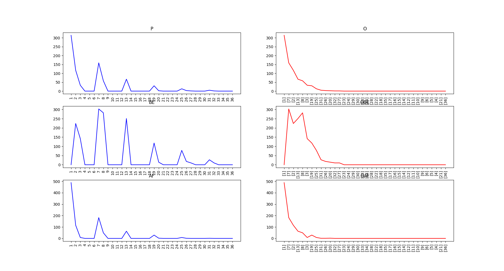
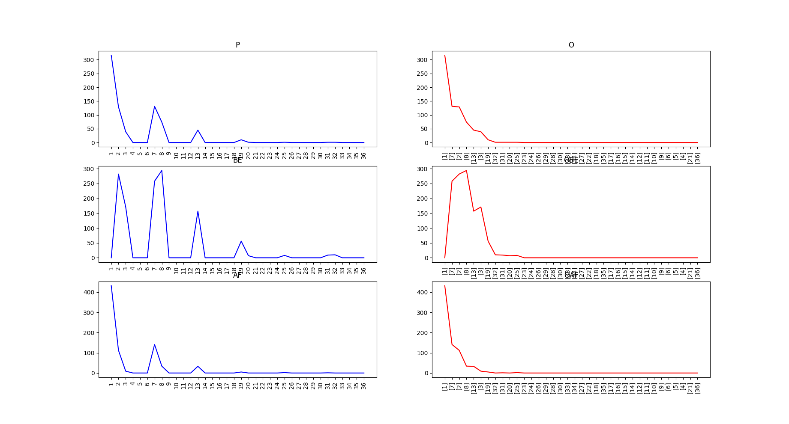
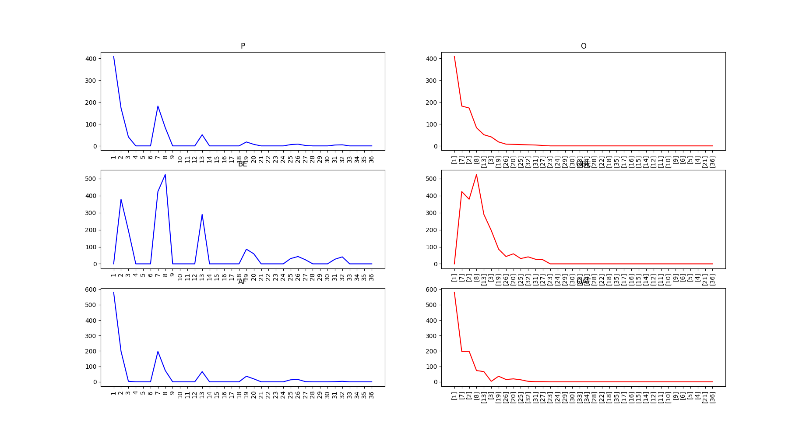
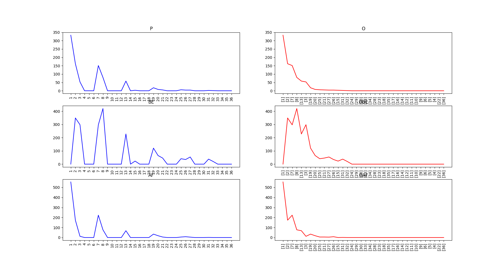
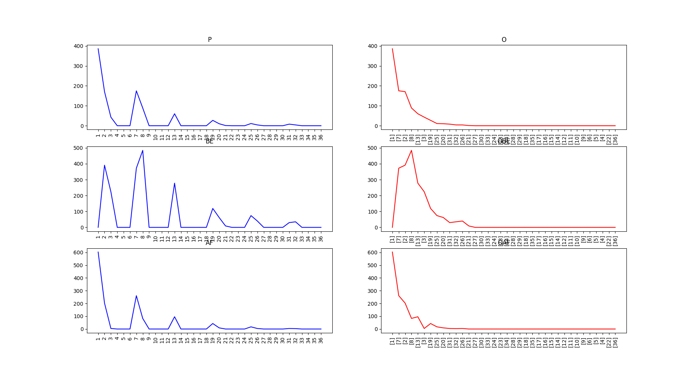
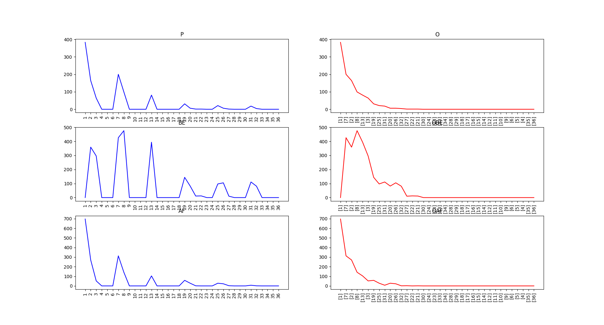
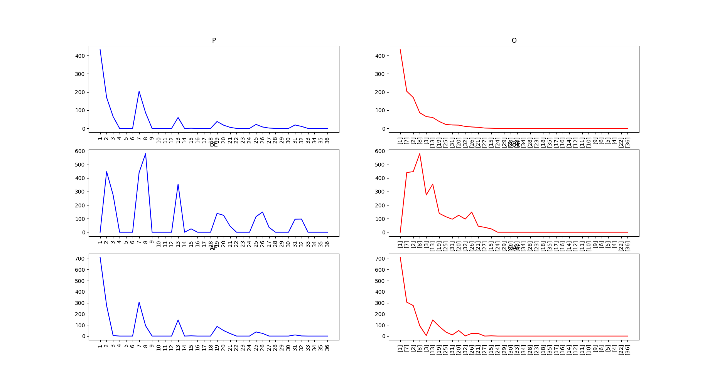
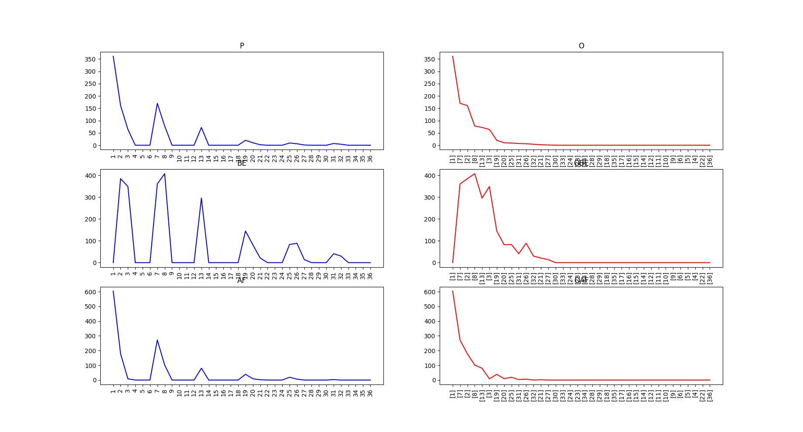
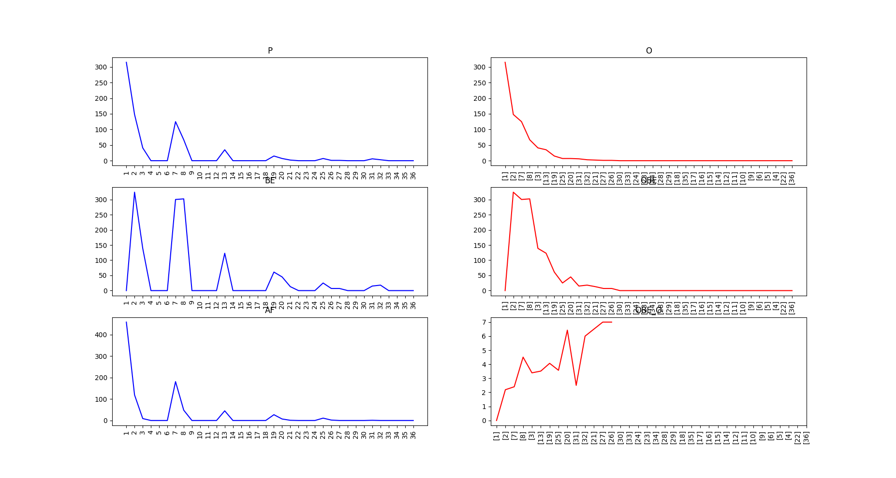
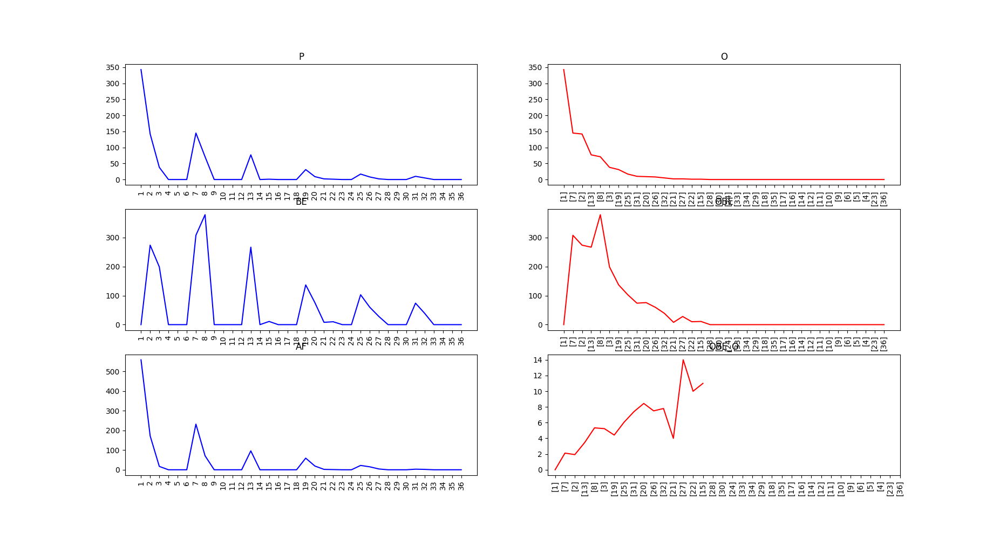

# Run by these command:

\# python -m baselines.UpTrend.test

# To Do

## Maze 环境

+ 获取关键状态，并进行可视化
+ 按步运行，并动态显示我们找到的关键状态 
+ 为关键状态赋值，并将其融入Qlearning 算法
+ 设计并完成比较实验，证明， 这种发现关键状态的方法可以加速Q-Learning的收敛 

## Montezuma's R


# Note & Results

## Maze 环境

环境截图：




\# python -m baselines.UpTrend.State_Im_MAZE

通过统计的方法寻找可能用来衡量状态重要性的指标
+ 随机与环境交互 M 次，每次走 N 步， 得到轨迹 集合 trjs
+ 通过对trjs进行统计，得到以下可能的评价指标
+ SumWi= SumWik(trjs) #状态 S_k 在所有轨迹中出现的顺序总和
+ P_k #状态S_k出现的数目总和
+ BE_k #状态 S_k之前出现的状态的统计数量总和
+ AF_k #状态 S_k之后出现的状态的统计数量总和
+ O #P_k 从高到底排序之后的结果
+ OBE_k # 排序之后对应的BE_k, 涵义难易程度相近的几个状态，谁之前包含的信息更多
+ OAF_k # 排序之后对应的AF_k
+ 未完待续。。。

step = 10 n_trjs = 100 三次随机实验结果







step = 20 n_trjs =100 三次随机实验结果







step = 30 n_trjs = 100 三次随机实验的结果







从效果上看，OBE中所见更符合我们对重要状态的直观认知，且，step选择多了会让后面的状态有更多机会进入视野当中 来

另外，观察了一下OBE/O的效果：

step = 10 n_trjs= 100 (OBE/O的效果在第六个子图中)




step = 20 n_trjs= 100 (OBE/O的效果在第六个子图中)



step = 30 n_trjs= 100 (OBE/O的效果在第六个子图中)



但是实验效果并不稳定，随机性比较大

尝试求出对应的极点，按照难易程度引入值函数。（这里的难易程度指得是出现次数的多少）

\# python -m baselines.UpTrend.UptrendStateValueRL

暂时先用 OBE 试验整个流程，然后引入不同的定义方式


